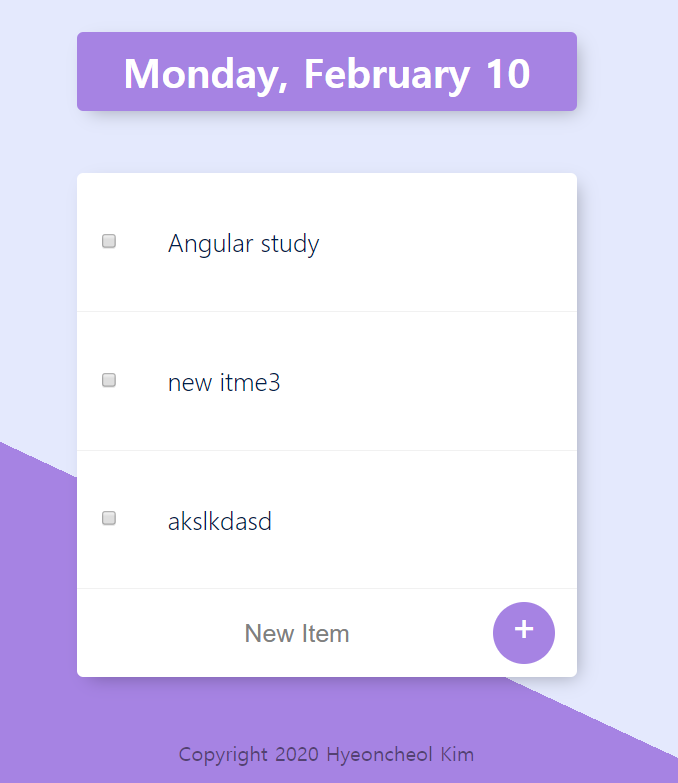

# todolist

## Use following command:
 * $npm i  // to install packages.
 * $mongod // starting mongodb
 * $node app.js // run the app.

It will run on your <localhost:3000>

## To create custom list
 localhost:3000/your-name-of-list
  

